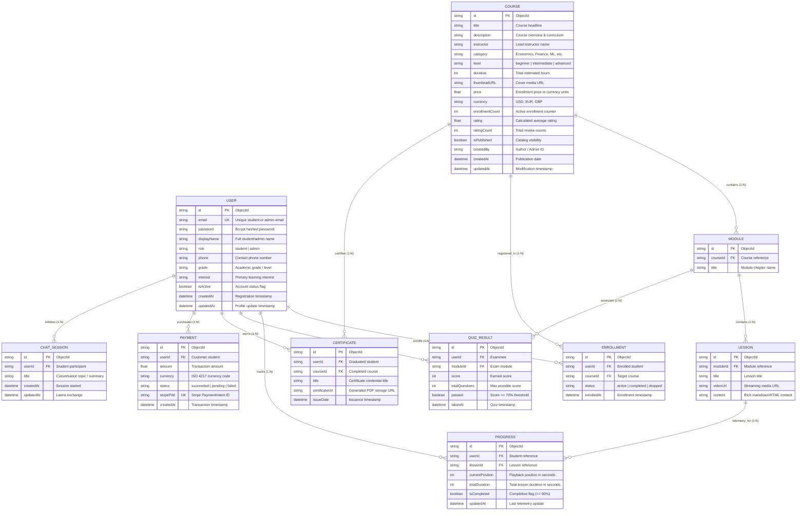

# AutoLearn — Entity-Relationship Diagram (ERD) Specification

This document defines the complete **Entity-Relationship Data Architecture** for the **AutoLearn** platform. It covers the **10 core database entities**, their attributes, relationships, cardinalities, indexes, and normalization rules.

---

## 1. Visual Entity-Relationship Diagram

---

## 2. Comprehensive Data Dictionary (10 Entities)

### 1. `USER`
Represents student learners and platform administrators.
- **`id`** (`ObjectId`, PK): Unique surrogate identifier.
- **`email`** (`VARCHAR(255)`, UNIQUE, NOT NULL): Account login identifier.
- **`password`** (`VARCHAR(255)`, NOT NULL): Salted bcrypt hashed credential.
- **`displayName`** (`VARCHAR(100)`, NULLABLE): User's public full name.
- **`role`** (`ENUM('student', 'admin')`, DEFAULT `'student'`): Authorization control.
- **`phone`** (`VARCHAR(30)`, NULLABLE): SMS or two-factor contact.
- **`grade`** (`VARCHAR(50)`, NULLABLE): Grade level (e.g. Undergraduate, High School).
- **`interest`** (`VARCHAR(100)`, NULLABLE): Topic recommendation interest.
- **`isActive`** (`BOOLEAN`, DEFAULT `TRUE`): Soft-delete or account suspension flag.
- **`createdAt`** (`TIMESTAMP`, DEFAULT `NOW()`): Registration timestamp.
- **`updatedAt`** (`TIMESTAMP`, ON UPDATE `NOW()`): Last profile change timestamp.

### 2. `COURSE`
The core commercial and educational offering in the catalog.
- **`id`** (`ObjectId`, PK): Unique course ID.
- **`title`** (`VARCHAR(200)`, NOT NULL): Course title.
- **`description`** (`TEXT`, NOT NULL): Full syllabus and summary.
- **`instructor`** (`VARCHAR(100)`, DEFAULT `'Admin'`): Instructor name.
- **`category`** (`VARCHAR(50)`, DEFAULT `'General'`): Subject taxonomy.
- **`level`** (`ENUM('beginner', 'intermediate', 'advanced')`, DEFAULT `'beginner'`): Difficulty tier.
- **`duration`** (`INT`, DEFAULT `0`): Course hours.
- **`thumbnailURL`** (`TEXT`, NULLABLE): CDN URL for course artwork.
- **`price`** (`DECIMAL(10, 2)`, DEFAULT `0.00`): Course price.
- **`currency`** (`CHAR(3)`, DEFAULT `'USD'`): Currency code.
- **`enrollmentCount`** (`INT`, DEFAULT `0`): Denormalized counter for quick ranking.
- **`rating`** (`DECIMAL(3, 2)`, DEFAULT `0.0`): Aggregated customer star rating.
- **`ratingCount`** (`INT`, DEFAULT `0`): Denormalized review counter.
- **`isPublished`** (`BOOLEAN`, DEFAULT `FALSE`): Draft or public state.
- **`createdBy`** (`VARCHAR(100)`, DEFAULT `'system'`): Course author ID.
- **`createdAt`** (`TIMESTAMP`, DEFAULT `NOW()`): Creation timestamp.
- **`updatedAt`** (`TIMESTAMP`, ON UPDATE `NOW()`): Modification timestamp.

### 3. `MODULE`
Chapters or sections that divide a course into pedagogical phases.
- **`id`** (`ObjectId`, PK): Unique module ID.
- **`courseId`** (`ObjectId`, FK, NOT NULL): References `COURSE.id` with `ON DELETE CASCADE`.
- **`title`** (`VARCHAR(200)`, NOT NULL): Module title (e.g. "Chapter 1: Microeconomic Equilibrium").

### 4. `LESSON`
The atomic unit of learning containing instructional media.
- **`id`** (`ObjectId`, PK): Unique lesson ID.
- **`moduleId`** (`ObjectId`, FK, NOT NULL): References `MODULE.id` with `ON DELETE CASCADE`.
- **`title`** (`VARCHAR(200)`, NOT NULL): Lesson title.
- **`videoUrl`** (`TEXT`, NULLABLE): Streaming media link (MinIO or YouTube).
- **`content`** (`TEXT`, NULLABLE): Lecture text, equations, and notes.

### 5. `ENROLLMENT`
Junction entity establishing a student's legal and academic registration in a course.
- **`id`** (`ObjectId`, PK): Unique enrollment record ID.
- **`userId`** (`ObjectId`, FK, NOT NULL): References `USER.id` with `ON DELETE CASCADE`.
- **`courseId`** (`ObjectId`, FK, NOT NULL): References `COURSE.id` with `ON DELETE CASCADE`.
- **`status`** (`ENUM('active', 'completed', 'dropped')`, DEFAULT `'active'`): Student lifecycle status.
- **`enrolledAt`** (`TIMESTAMP`, DEFAULT `NOW()`): Enrollment date.
- **Constraint**: `UNIQUE(userId, courseId)` prevents duplicate enrollments.

### 6. `PROGRESS`
Real-time telemetry tracking student playback position and milestone completion.
- **`id`** (`ObjectId`, PK): Unique progress telemetry ID.
- **`userId`** (`ObjectId`, FK, NOT NULL): References `USER.id` with `ON DELETE CASCADE`.
- **`lessonId`** (`ObjectId`, FK, NOT NULL): References `LESSON.id` with `ON DELETE CASCADE`.
- **`currentPosition`** (`INT`, DEFAULT `0`): Playback position in seconds.
- **`totalDuration`** (`INT`, DEFAULT `0`): Total video duration in seconds.
- **`isCompleted`** (`BOOLEAN`, DEFAULT `FALSE`): Marked true when >= 90% is consumed.
- **`updatedAt`** (`TIMESTAMP`, ON UPDATE `NOW()`): Last heartbeat timestamp.
- **Constraint**: `UNIQUE(userId, lessonId)`.

### 7. `QUIZ_RESULT`
Records of student performance on module assessment checkpoints.
- **`id`** (`ObjectId`, PK): Unique quiz attempt ID.
- **`userId`** (`ObjectId`, FK, NOT NULL): References `USER.id` with `ON DELETE CASCADE`.
- **`moduleId`** (`ObjectId`, FK, NOT NULL): References `MODULE.id` with `ON DELETE CASCADE`.
- **`score`** (`INT`, NOT NULL): Points earned by student.
- **`totalQuestions`** (`INT`, NOT NULL): Maximum possible points.
- **`passed`** (`BOOLEAN`, NOT NULL): Whether score satisfies pass threshold (e.g. >= 70%).
- **`takenAt`** (`TIMESTAMP`, DEFAULT `NOW()`): Submission timestamp.

### 8. `CERTIFICATE`
Tamper-evident verification credential issued when a course is 100% completed.
- **`id`** (`ObjectId`, PK): Unique credential ID.
- **`userId`** (`ObjectId`, FK, NOT NULL): References `USER.id` with `ON DELETE CASCADE`.
- **`courseId`** (`ObjectId`, FK, NOT NULL): References `COURSE.id` with `ON DELETE CASCADE`.
- **`title`** (`VARCHAR(200)`, NOT NULL): Certificate title.
- **`certificateUrl`** (`TEXT`, NULLABLE): PDF download URL on MinIO/S3.
- **`issueDate`** (`TIMESTAMP`, DEFAULT `NOW()`): Issuance date.

### 9. `PAYMENT`
Immutable ledger entry for commercial transactions processed via Stripe.
- **`id`** (`ObjectId`, PK): Unique payment record ID.
- **`userId`** (`ObjectId`, FK, NOT NULL): References `USER.id` with `ON DELETE CASCADE`.
- **`amount`** (`DECIMAL(10, 2)`, NOT NULL): Paid amount.
- **`currency`** (`CHAR(3)`, DEFAULT `'USD'`): Currency code.
- **`status`** (`ENUM('succeeded', 'pending', 'failed')`, NOT NULL): Payment gateway outcome.
- **`stripePiId`** (`VARCHAR(255)`, UNIQUE, NOT NULL): Stripe PaymentIntent identifier.
- **`createdAt`** (`TIMESTAMP`, DEFAULT `NOW()`): Timestamp of payment.

### 10. `CHAT_SESSION`
Contextual dialogue sessions conducted with the integrated AI Economics tutor.
- **`id`** (`ObjectId`, PK): Unique chat session thread ID.
- **`userId`** (`ObjectId`, FK, NOT NULL): References `USER.id` with `ON DELETE CASCADE`.
- **`title`** (`VARCHAR(200)`, NULLABLE): Auto-generated thread summary.
- **`createdAt`** (`TIMESTAMP`, DEFAULT `NOW()`): Thread creation time.
- **`updatedAt`** (`TIMESTAMP`, ON UPDATE `NOW()`): Last message time.

---

## 3. Relationship Cardinality Matrix

| Parent Entity | Relationship | Child Entity | Cardinality | Business Rule |
|:---|:---|:---|:---:|:---|
| **Course** | Contains | **Module** | 1 : N | A course must contain at least 1 module; a module belongs to exactly 1 course. |
| **Module** | Contains | **Lesson** | 1 : N | A module has 1 or more lessons; a lesson belongs to exactly 1 module. |
| **User** | Registers | **Enrollment** | 1 : N | A user can register in 0 or many courses. |
| **Course** | Accepts | **Enrollment** | 1 : N | A course can have 0 or many enrolled students. |
| **User** | Tracks | **Progress** | 1 : N | A user tracks progress across multiple lessons. |
| **Lesson** | Measured by | **Progress** | 1 : N | A lesson has 1 progress record per enrolled student. |
| **Module** | Evaluates | **QuizResult** | 1 : N | A module can be tested multiple times across users. |
| **User** | Submits | **QuizResult** | 1 : N | A user can submit multiple quiz attempts. |
| **Course** | Awards | **Certificate** | 1 : N | A course can issue certificates to all graduating students. |
| **User** | Receives | **Certificate** | 1 : N | A student receives 1 certificate per completed course. |
| **User** | Transacts | **Payment** | 1 : N | A student makes payments for course enrollments. |
| **User** | Converses with | **ChatSession** | 1 : N | A student opens ongoing or archived AI tutoring threads. |

---

## 4. Normalization and Integrity Rules

1. **Third Normal Form (3NF)**:
   - All non-key attributes are fully and functionally dependent only on the Primary Key.
   - Transitive dependencies are removed (e.g. Lesson belongs to Module; Module belongs to Course; Lesson does not duplicate Course ID).
2. **Referential Integrity & Cascading**:
   - `ON DELETE CASCADE` is enforced so that deleting a course cleans up child modules, lessons, enrollments, and certificates without orphaned records.
3. **Compound Uniqueness**:
   - `UNIQUE(userId, courseId)` in `ENROLLMENT` guarantees no duplicate fee charges or concurrent registrations.
   - `UNIQUE(userId, lessonId)` in `PROGRESS` maintains a single live playback bookmark per student per lesson.
