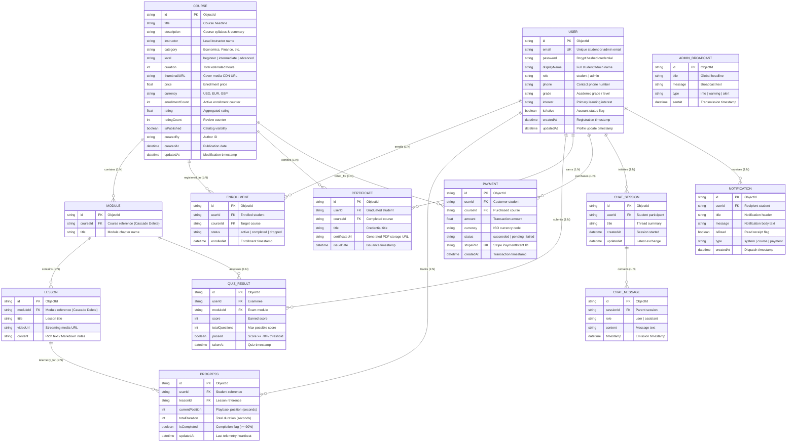
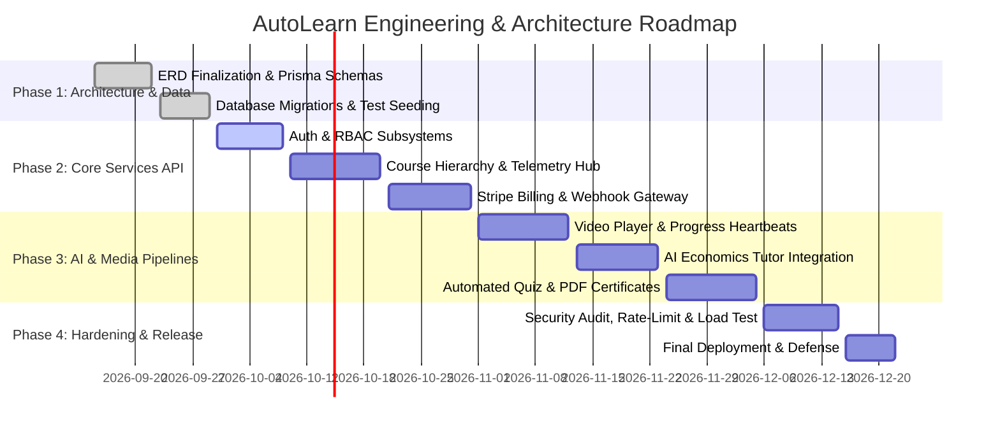

# PROJECT PROPOSAL
## AutoLearn: An Enterprise-Grade Intelligent Economics Learning Management System (LMS)
**Software Design, Systems Architecture, and Data Modeling Specification**

---

### Project Metadata & Team Identification

| Field | Details |
| :--- | :--- |
| **Project Title** | **AutoLearn** — Intelligent Adaptive Economics Learning Management System |
| **Document Version** | 1.0.0 (Architecture Baseline & Software Proposal) |
| **Target Platforms** | Cross-Platform Client (Flutter Web, iOS, Android, Desktop) & Microservices/REST API |
| **Date** | September 13, 2026 |

#### Group Members

| Member Name | Student / Employee ID | Primary Architectural Role | Key Responsibilities |
| :--- | :--- | :--- | :--- |
| **[Member 1 Name]** | `[STU-000001]` | **Lead Software Architect & PM** | System topology, architectural patterns, design review, API contract definition |
| **[Member 2 Name]** | `[STU-000002]` | **Database & Data Architect** | ERD modeling, Prisma ORM schema, normalization, integrity rules, query performance |
| **[Member 3 Name]** | `[STU-000003]` | **Backend & Security Engineer** | Express/TypeScript API, Stripe billing webhooks, RBAC auth, rate limiting |
| **[Member 4 Name]** | `[STU-000004]` | **Frontend & Mobile Engineer** | Flutter client architecture, state management, adaptive UI/UX, video player telemetry |
| **[Member 5 Name]** | `[STU-000005]` | **AI & Integration Engineer** | LLM Economics Tutor integration, automated quiz grading, MinIO S3 media pipelines |

---

## 1. Introduction & Executive Summary

### 1.1 Problem Statement & Background
Modern economics and financial literacy pedagogy demands more than static slide decks or passive video delivery. Learners struggle with abstract quantitative models (microeconomic equilibria, macroeconomic policy shifts, econometric regressions) without interactive pacing, real-time contextual feedback, and verified mastery milestones. Conversely, conventional LMS platforms either lack domain-specific cognitive scaffolding (such as an embedded AI Economics Tutor) or suffer from fragile, monolithic codebases with tight coupling, inconsistent telemetry tracking, and ad-hoc billing pipelines.

### 1.2 System Vision
**AutoLearn** is an enterprise-grade, cloud-native Learning Management System engineered specifically for economic and financial sciences. The platform combines:
1. A **high-performance, reactive multi-platform client** delivering lecture streams, interactive assignments, and financial dashboards.
2. A **resilient, decoupled Node.js/TypeScript application tier** orchestrated around clean architecture, service layers, and strictly typed domain models.
3. An **AI cognitive tutor engine** that ingests student queries and curricular context to generate real-time Socratic feedback.
4. A **rigorous, normalized data layer** designed to maintain ACID compliance for billing transactions, sub-second telemetry write throughput for video playback, and referential integrity across course hierarchies.

---

## 2. Software Architecture & System Design Overview

From a software engineering and system architecture perspective, AutoLearn is structured according to **Clean Architecture** and **Multi-Tier Layered Architecture** principles, enforcing the **Separation of Concerns (SoC)** and **Single Responsibility Principle (SRP)**.

```
+-----------------------------------------------------------------------------------+
|                            PRESENTATION TIER (CLIENT)                             |
|               Flutter Multi-Platform (Web / Mobile / macOS / Windows)             |
|   +--------------------+  +----------------------+  +-------------------------+   |
|   | Student UI Screens |  | Admin Ops Dashboards |  | Interactive Media/Video |   |
|   +--------------------+  +----------------------+  +-------------------------+   |
+------------------------------------------|----------------------------------------+
                                           | HTTPS / WSS / REST JSON
                                           v
+-----------------------------------------------------------------------------------+
|                          APPLICATION & API GATEWAY TIER                           |
|       Express.js 5.x / TypeScript / Reverse Proxy (Nginx) / Helmet / Rate Limit   |
|   +--------------------+  +----------------------+  +-------------------------+   |
|   | Auth & RBAC Guards |  | Validation Middleware|  | Telemetry Ingestion Hub |   |
|   +--------------------+  +----------------------+  +-------------------------+   |
+------------------------------------------|----------------------------------------+
                                           | Internal Domain Calls
                                           v
+-----------------------------------------------------------------------------------+
|                              BUSINESS DOMAIN SERVICES                             |
|   +--------------------+  +----------------------+  +-------------------------+   |
|   | Course Service     |  | Telemetry Service    |  | Quiz & Assessment Engine|   |
|   +--------------------+  +----------------------+  +-------------------------+   |
|   +--------------------+  +----------------------+  +-------------------------+   |
|   | Stripe Payment Svc |  | Certificate Issuer   |  | LLM AI Socratic Tutor   |   |
|   +--------------------+  +----------------------+  +-------------------------+   |
+------------------------------------------|----------------------------------------+
                                           | Data Access Layer / Prisma ORM
                                           v
+-----------------------------------------------------------------------------------+
|                        PERSISTENCE & INFRASTRUCTURE TIER                          |
|   +-----------------------------+  +-------------------+  +-------------------+   |
|   | MongoDB / PostgreSQL Engine |  | Redis 6 Cache &   |  | MinIO / S3 Bucket |   |
|   | (Normalized via Prisma)     |  | Distributed Rate  |  | (Media & PDFs)    |   |
|   +-----------------------------+  +-------------------+  +-------------------+   |
+-----------------------------------------------------------------------------------+
```

### 2.1 Design Patterns Employed
- **Repository Pattern & Data Mapper**: Abstracting raw database mutations behind typed interfaces, enabling testability and decoupling database engines from business rules.
- **Service Layer Pattern**: Encapsulating orchestration logic (e.g., enrolling a student triggers payment validation, enrollment record creation, progress initialization, and welcome notifications in a single transaction).
- **Observer / Event Hook Pattern**: Used for telemetry collection and automated course completion detection (when a student marks >= 90% of all lesson progress and passes the module quiz, the certificate generation worker fires asynchronously).
- **Factory & Strategy Patterns**: Utilized for pluggable payment providers (Stripe PaymentIntent handling) and AI models (OpenAI/Gemini adapters).

---

## 3. System Functionalities & Subsystem Decomposition

The platform is decomposed into ten high-cohesion, low-coupling subsystems:

### 3.1 Identity & Access Management (IAM) Subsystem
- **Role-Based Access Control (RBAC)**: Distinguishes between `student` and `admin` actors with distinct authorization boundaries.
- **Token-Based Stateless Authentication**: Issues signed JSON Web Tokens (JWT) with cryptographic validation, rotating refresh tokens, and salted `bcrypt` password hashing.
- **Account State Machine**: Supports profile modification, grade and interest specialization tagging, and administrative soft-deactivation (`isActive`).

### 3.2 Curricular Content Hierarchy Subsystem
- **3-Level Nested Composition**: Implements a strict `Course -> Module -> Lesson` hierarchy.
- **Rich Instructional Content Delivery**: Supports structured lecture markdown, rich mathematical LaTeX notation, and high-bitrate streaming media URLs (via S3/MinIO).
- **Metadata Management**: Tracks course difficulty (`beginner`, `intermediate`, `advanced`), estimated duration, instructor attributions, pricing, and category taxonomy.

### 3.3 Enrollment & Academic Lifecycle Subsystem
- **Atomic Registration**: Manages student matriculation into courses with lifecycle states: `active`, `completed`, and `dropped`.
- **Duplicate Prevention Guarantee**: Enforces compound database unique constraints `(userId, courseId)` to eliminate duplicate billing and double enrollment anomalies.

### 3.4 Video Streaming & Granular Telemetry Subsystem
- **Real-Time Playback Heartbeats**: Ingests periodic student playback positions (`currentPosition` vs `totalDuration`) via debounced telemetry endpoints.
- **Automatic Milestone Completion**: Programmatically flips the `isCompleted` flag once telemetry confirms >= 90% consumption of the instructional unit.
- **Resume-Anywhere Capability**: Restores exact video timestamps across disparate devices.

### 3.5 Adaptive Assessment & Automated Quiz Engine
- **Module-Level Competency Checkpoints**: Evaluates mastery at the conclusion of each pedagogical chapter.
- **Automated Grading & Scoring**: Computes total scores against pass thresholds (>= 70%) with persistent historical tracking in `QUIZ_RESULT`.

### 3.6 Automated Credentialing & Certification Subsystem
- **Tamper-Evident Graduation Credentials**: Emits verifiable digital certificates upon 100% course and quiz completion.
- **Asynchronous Document Compilation**: Generates immutable PDF artifacts rendered to cloud object storage with permanent URL generation.

### 3.7 Financial & Commercial Billing Subsystem
- **Stripe Gateway Integration**: Direct integration with Stripe's `PaymentIntent` API, supporting secure card processing and 3D Secure verification.
- **Idempotent Webhook Processing**: Stores unique `stripePiId` keys with indexed uniqueness constraints, preventing double-crediting during network retries.
- **Financial Audit Ledger**: Fully immutable transactional records capturing amounts, currency ISO codes, and payment statuses (`succeeded`, `pending`, `failed`).

### 3.8 AI-Powered Contextual Economics Tutor
- **Stateful Dialogue Threads**: Maintains conversational sessions (`CHAT_SESSION` and `CHAT_MESSAGE`) per student and course topic.
- **Context-Aware Socratic Assistance**: Augments LLM prompts with syllabus metadata, allowing students to ask conceptual economics questions (e.g., *"Explain Deadweight Loss under a price ceiling"*).

### 3.9 Notification & System Broadcast Subsystem
- **User-Specific Notifications**: Real-time push and in-app alerts regarding enrollment confirmations, grade releases, and system updates.
- **Global Administrative Broadcasts**: System-wide announcements emitted to all active students simultaneously.

### 3.10 Administrative Governance & Analytics Subsystem
- **Telemetry & Revenue Analytics**: Centralized metrics tracking gross revenue, active student count, top-performing courses, and completion drop-off rates.
- **Curriculum Authoring Suite**: Admin screens for draft creation, module sequencing, lesson publishing, and asset uploading.

---

## 4. Entity-Relationship Diagram (ERD) Specification

The system's data architecture is normalized to **Third Normal Form (3NF)** to eliminate redundancy, avoid update anomalies, and enforce relational consistency.

### 4.1 Visual ERD (Mermaid Notation)



---

### 4.2 Relational Cardinality & Referential Integrity Matrix

| Parent Entity | Relationship | Child Entity | Cardinality | Cascade Action | Architectural Enforcement |
| :--- | :--- | :--- | :---: | :--- | :--- |
| **`COURSE`** | Contains | **`MODULE`** | 1 : N | `ON DELETE CASCADE` | Deleting a course purges child chapters. |
| **`MODULE`** | Contains | **`LESSON`** | 1 : N | `ON DELETE CASCADE` | Deleting a module purges all associated lessons. |
| **`USER`** | Registers | **`ENROLLMENT`** | 1 : N | `ON DELETE CASCADE` | Student account removal cleans registrations. |
| **`COURSE`** | Accepts | **`ENROLLMENT`** | 1 : N | `ON DELETE CASCADE` | Course removal purges student enrollments. |
| **`USER`** | Generates | **`PROGRESS`** | 1 : N | `ON DELETE CASCADE` | `UNIQUE(userId, lessonId)` guarantees 1 live telemetry record. |
| **`LESSON`** | Measured by | **`PROGRESS`** | 1 : N | `ON DELETE CASCADE` | Removing a lesson cleans historical playheads. |
| **`MODULE`** | Evaluates | **`QUIZ_RESULT`** | 1 : N | `ON DELETE CASCADE` | Quizzes correlate to specific curricular units. |
| **`USER`** | Earns | **`CERTIFICATE`** | 1 : N | `ON DELETE CASCADE` | Issued upon meeting 100% course requirements. |
| **`USER`** | Transacts | **`PAYMENT`** | 1 : N | `ON DELETE CASCADE` | `UNIQUE(stripePiId)` ensures transaction idempotency. |
| **`USER`** | Convenes | **`CHAT_SESSION`** | 1 : N | `ON DELETE CASCADE` | AI tutoring session container. |
| **`CHAT_SESSION`**| Houses | **`CHAT_MESSAGE`** | 1 : N | `ON DELETE CASCADE` | Chronological conversation turns. |

---

## 5. Non-Functional Architecture & Cross-Cutting Concerns

### 5.1 Security Architecture
- **Defense in Depth**: Express API secured with HTTP header hardening via `helmet`, Cross-Origin Resource Sharing (`cors`) policies, and payload limits.
- **Credential Storage**: Passwords hashed with standard work-factor `bcrypt` salt generation before persistence; raw plaintext passwords never touch database logs.
- **DDoS & Brute-Force Mitigation**: Distributed rate-limiting via Redis (`express-rate-limit` with Redis store) applied strictly to authentication routes (`/api/auth/login`, `/api/auth/signup`) and LLM chat endpoints.
- **Payment Security & PCI Compliance**: Credit card data flows directly between the Flutter client and Stripe via Stripe Elements/SDK; the backend only receives signed PaymentIntents, remaining out of PCI DSS audit scope.

### 5.2 Performance & Scalability Strategy
- **Sub-Second Telemetry Ingestion**: Playhead progress pings (`POST /api/progress`) utilize an upsert pattern with Redis-backed write batching to prevent database saturation during peak lecture streaming hours.
- **Index Optimization**: Composite indexes on `[userId, courseId]` and `[userId, lessonId]` ensure O(1) search complexity for student authorization and state checks.
- **Stateless Microservice Readiness**: Session state is completely decoupled from API server memory, enabling horizontal auto-scaling of backend instances behind an Nginx or Kubernetes ingress controller.

### 5.3 Reliability, ACID Guarantees & Recovery
- **Idempotent Webhook Processing**: Payment fulfillment verifies webhook cryptographic signatures and evaluates `stripePiId` uniqueness prior to state transitions.
- **High-Availability Storage**: Instructional videos and generated certificate PDFs are hosted on an S3-compatible object storage layer (MinIO/AWS S3), mitigating server disk bottlenecks.

---

## 6. Technology Stack & Architectural Justification

```
+-----------------------------------------------------------------------------------------+
|                                    TECHNOLOGY STACK                                     |
+-------------------+---------------------------------------------------------------------+
| Client Layer      | Flutter 3.x (Dart), Riverpod/Provider State Management,             |
|                   | Material 3 Design System, YouTube API / Video Player SDK            |
+-------------------+---------------------------------------------------------------------+
| Application Layer | Node.js 20+ LTS, Express 5.x, TypeScript 5.x, Helmet, CORS, Multer  |
+-------------------+---------------------------------------------------------------------+
| Persistence Layer | MongoDB / PostgreSQL managed via Prisma ORM 5.x                      |
+-------------------+---------------------------------------------------------------------+
| Caching & Queues  | Redis 6.x (Session tokens, distributed rate limits, telemetry cache)|
+-------------------+---------------------------------------------------------------------+
| Cloud & Storage   | MinIO / Amazon S3 (Instructional media, thumbnails, PDF certs)       |
+-------------------+---------------------------------------------------------------------+
| External Services | Stripe API (Payments), OpenAI / Google Gemini (AI Economics Tutor)  |
+-------------------+---------------------------------------------------------------------+
```

- **Why Flutter for the Client?** Allows single-codebase cross-platform deployment across iOS, Android, and Web with native 60fps rendering, essential for rendering complex economic charts, formula sheets, and video feeds.
- **Why TypeScript + Express + Prisma?** Strong typing eliminates runtime schema discrepancies between database records and API controllers. Prisma provides compile-time query safety, migrations, and relationship validation.
- **Why Redis for Rate-Limiting?** Essential for protecting expensive external API surfaces (such as AI LLM calls and Stripe checkouts) from abuse.

---

## 7. Project Roadmap & Delivery Milestones



---

## 8. Conclusion & Architectural Recommendation

The **AutoLearn** system architecture unites an expressive, multi-platform user interface with a robust, type-safe backend and a normalized 3NF data tier. By strictly decoupling commercial transactions, pedagogical telemetry, and cognitive AI services, the architecture delivers:
- **Zero data loss & payment integrity** via atomic constraints and idempotent Stripe handlers.
- **Scalable, sub-second telemetry tracking** for granular video playback analytics.
- **Extensible foundation** for future integrations (e.g., live streaming economics webinars, collaborative peer study groups, and gamified financial simulations).

This project proposal serves as the architectural contract for development, guiding implementation, testing, and deployment phases.
